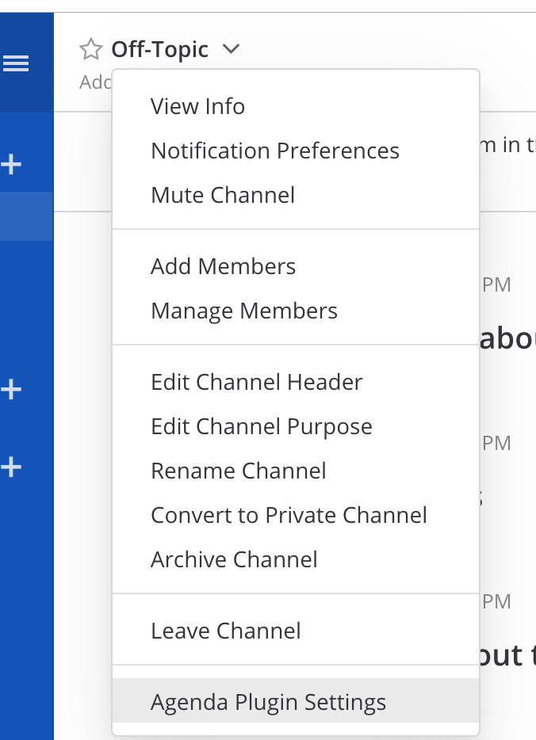
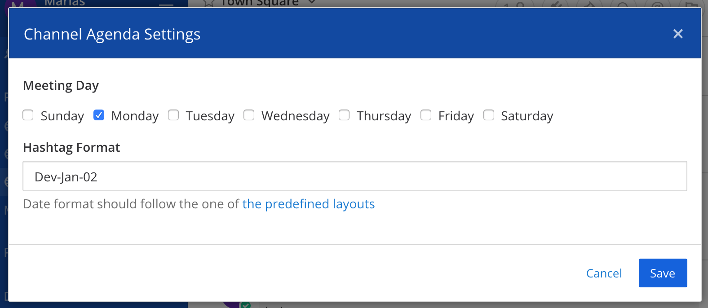
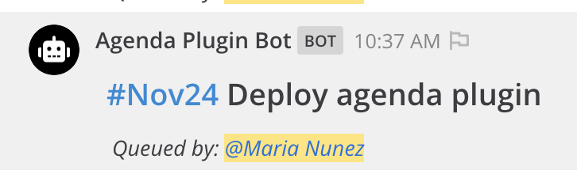

# Agenda Plugin

[](https://circleci.com/gh/mattermost/mattermost-plugin-agenda)
[](https://goreportcard.com/report/github.com/mattermost/mattermost-plugin-agenda)
[](https://codecov.io/gh/mattermost/mattermost-plugin-agenda)

**Maintainer:** [@jfrerich](https://github.com/jfrerich)
**Co-Maintainer:** [@iomodo](https://github.com/iomodo)

The Agenda Plugin helps users queue and list items in a channel's meeting agenda. The agenda is identified by a hashtag based on the meeting date.

The plugin will create posts for the user preceding the agenda item with configured hashtag format and can open a search with that hashtag to view the agenda list. 

Initial development as part of [Mattermost Hackathon 2019](https://github.com/mattermost/mattermost-hackathon-nov2019) which was demoed [here](https://drive.google.com/file/d/1t-ho4ZwGDxLVVWUi0sX7KpQZqKNxujlJ/view) starting at 13:50.

## Usage

#### Meeting Settings Configuration

The meeting settings for each channel can be configured in the Channel Header Dropdown.





Meeting settings include:

- Schedule Day: Day of the week when the meeting is scheduled.  Monday is `1`
- Hashtag Format: The format of the hashtag for the meeting date. The date format is based on [Go date and time formatting](https://yourbasic.org/golang/format-parse-string-time-date-example/#standard-time-and-date-formats)

#### Slash Commands to manage the meeting agenda:

```
/agenda queue [next-week] message
```
Creates a post for the user with the given `message` for the next meeting date. The configured hashtag will precede the `message`.
If `next-week` is indicated (optional), it will use the date of the meeting in the next calendar week. 



```
/agenda list [next-week]
```
Executes a search of the hashtag of the next meeting, opening the RHS with all the posts with that hashtag. 
If `next-week` is indicated (optional), it will use the date of the meeting in the next calendar week. 

```
/agenda setting field value
```
Updates the given setting with the provided value for the meeting settings of that channel. 

`Field` can be one of:

- `schedule`: Day of the week of the meeting. It is an int based on [`time.Weekday`](https://golang.org/pkg/time/#Weekday)
- `hashtag`: Format of the hashtag for the meeting date. It is based on the format used in [`time.Format`](https://golang.org/pkg/time/#Time.Format)

## Future Improvements

- Mark items as resolved or queue for next week. 
- Queue a post using a menu option in the post dot menu. 
- Handle multiple meeting days in a week.
- Handle time in meeting schedule. 

## Contributing

If you would like to make contributions to this plugin, please checkout the open issues labeled [`Help Wanted` and `Up For Grabs`](https://github.com/mattermost/mattermost-plugin-agenda/issues?q=is%3Aopen+label%3A%22Up+For+Grabs%22+label%3A%22Help+Wanted%22)
